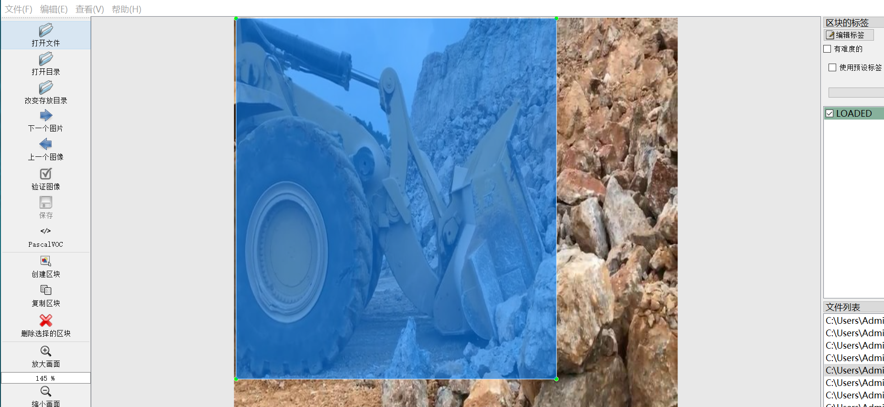
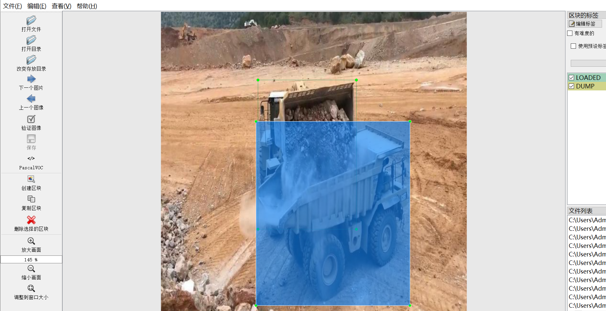
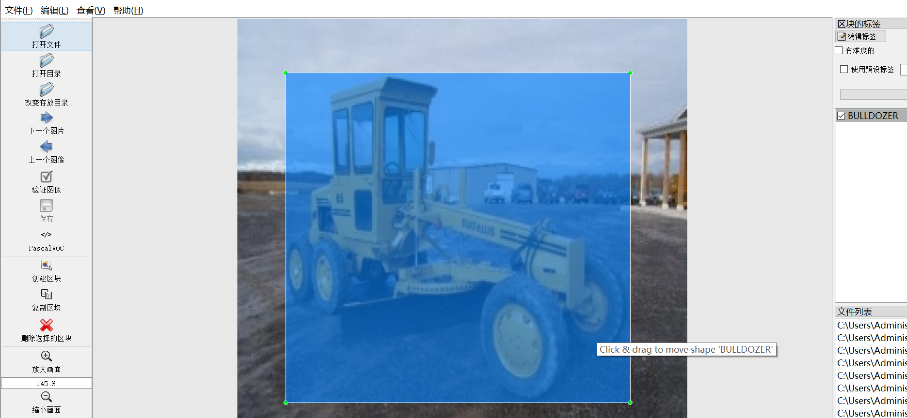
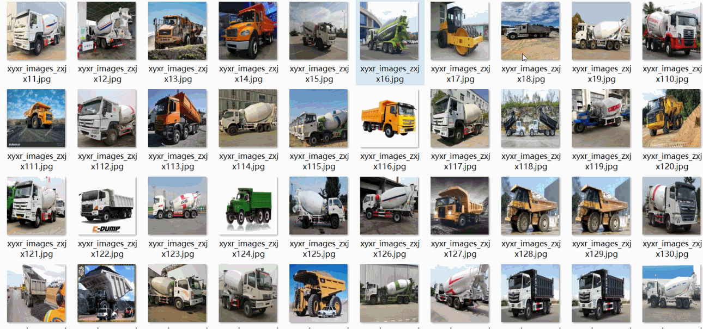

# 【Engineering Vehicle Car 】7 typesEngineering Vehicle vehicle minutes Recognition Detection Dataset 7492 imagesYOLO+VOC format

【Engineering Vehicles】7 types of engineering vehicles identification and detection dataset, 7492 images in YOLO+VOC format:

The compressed file contains: three folders, each storing images, xml files, and text files.

The total number of jpg images in the JPEGImages folder is: 7492.

The total number of XML files in the Annotations folder is: 7492.

The total number of txt files in the labels folder is 7492.

Total number of tag types: 7

Tags: ["BULLDOZER", "DUMP", "EXCAVATOR", "LOADED", "MIXER", "MOXY", "ROLLER"]

The number of boxes for each label (Note that the order of labels in the Yolo format does not correspond to this, but is based on the classes.txt file in the labels folder):

BULLDOZER frame count = 1073

The number of DUMP frames is 1489.

EXCAVATOR frame count = 2486

LOADED frame count = 1575

The number of MIXER frames is 1678.

MOXY Frames = 245

The number of rollers is 1049.

Total number of frames: 9595

Picture clarity (Resolution: Pixels): Clear

Image Enhancement: Yes

Shape of the label: Rectangular box, used for object detection and recognition.

Dataset Type ：249m

Special Notice: This dataset does not guarantee the accuracy or precision of the trained models or weight files. The dataset only provides accurate and reasonable annotations.

No specific annotation provided.

## Images

---

Here is a pay link on Stripe (https://buy.stripe.com/3cs8yP7sY87d0vu9AB). Please contact me lonlonago@foxmail.com after funding $89, and I will send you a complete data files, thank you!

